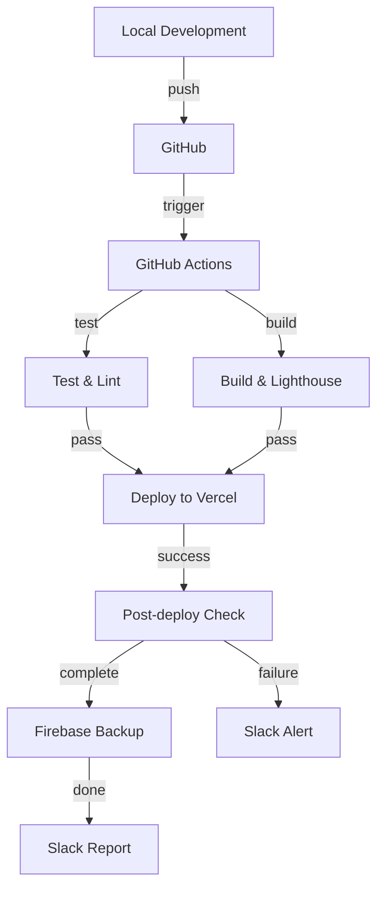

# ChartAI - AI 기반 차트 생성 서비스

## 프로젝트 개요
CSV/Excel 데이터를 업로드하면 AI가 적절한 차트를 추천하고 자동 생성해주는 웹 서비스입니다.

## 기술 스택
- **Frontend**: Next.js 14, React, TypeScript, TailwindCSS
- **차트 라이브러리**: Chart.js, react-chartjs-2
- **백엔드**: Firebase (Auth, Firestore, Storage)
- **AI**: OpenAI API
- **파일 처리**: papaparse, xlsx
- **UI 라이브러리**: lucide-react, react-dropzone
- **테스트**: Playwright, Lighthouse CI
- **최적화**: React Memo, WebP, 번들 분할

## 주요 기능
1. **파일 업로드 및 차트 생성**
   - CSV/Excel 파일 업로드 (단일/다중)
   - AI 기반 차트 자동 추천 및 생성
   - 드래그 앤 드롭 차트 템플릿 선택
   - 실시간 차트 커스터마이징

2. **클라우드 저장 및 관리**
   - 사용자별 차트 저장
   - 폴더 구조를 통한 체계적 관리
   - 차트 이미지 자동 저장
   - 기존 차트 편집 기능

3. **공유 및 협업**
   - 공유 링크 생성
   - 권한 기반 접근 제어 (읽기/수정)
   - 클라우드 저장소를 통한 안전한 공유

4. **다중 파일 리포트 생성**
   - 여러 개의 파일을 조합한 종합 리포트
   - 각 차트마다 다른 데이터 소스 선택
   - 그리드/자유 배치 레이아웃
   - 리포트 공유 및 다운로드

5. **기타 기능**
   - AI 요약 텍스트 자동 생성
   - PNG/JPG/WebP 이미지 저장
   - 시작 행 지정 기능

## 배포

### 자동 배포 (CI/CD)
```bash
# main 브랜치에 push하면 자동 배포
git push origin main

# 수동 트리거 (프로덕션 배포)
# GitHub Actions에서 Deploy to Production 워크플로 수동 실행
```

### Docker로 배포
```bash
# 이미지 빌드
docker build --build-arg NEXT_PUBLIC_FIREBASE_API_KEY=your_key \
             --build-arg NEXT_PUBLIC_FIREBASE_AUTH_DOMAIN=your_domain \
             --build-arg NEXT_PUBLIC_FIREBASE_PROJECT_ID=your_project \
             --build-arg NEXT_PUBLIC_FIREBASE_STORAGE_BUCKET=your_bucket \
             --build-arg NEXT_PUBLIC_FIREBASE_MESSAGING_SENDER_ID=your_sender_id \
             --build-arg NEXT_PUBLIC_FIREBASE_APP_ID=your_app_id \
             -t chartai:latest .

# 컨테이너 실행
docker run -p 3000:3000 chartai:latest

# docker-compose로 실행
docker-compose up
```

### Kubernetes 배포
```bash
# Secret 생성
kubectl apply -f k8s/secrets.yaml

# 배포
kubectl apply -f k8s/deployment.yaml
kubectl apply -f k8s/service.yaml
kubectl apply -f k8s/ingress.yaml

# 배포 상태 확인
kubectl get pods
kubectl logs -f deployment/chartai
```

### 환경별 배포 설정
- **Production**: Vercel 자동 배포
- **Staging**: 수동 트리거 배포
- **Development**: 로컬 실행

### 배포 관련 파일
- `.github/workflows/deploy.yml`: GitHub Actions 워크플로
- `Dockerfile`: Docker 이미지 설정
- `k8s/`: Kubernetes 매니페스트 파일
- `scripts/post-deploy.sh`: 배포 후 검증 스크립트
- `scripts/backup-firebase.js`: Firebase 백업 스크립트

## 설치 및 실행

### 1. 의존성 설치
```bash
npm install
```

### 2. 환경 변수 설정
`.env.example` 파일을 `.env.local`로 복사하고 다음 값들을 입력해주세요:

```env
# Firebase 설정
NEXT_PUBLIC_FIREBASE_API_KEY=your_api_key
NEXT_PUBLIC_FIREBASE_AUTH_DOMAIN=your_auth_domain
NEXT_PUBLIC_FIREBASE_PROJECT_ID=your_project_id
NEXT_PUBLIC_FIREBASE_STORAGE_BUCKET=your_storage_bucket
NEXT_PUBLIC_FIREBASE_MESSAGING_SENDER_ID=your_sender_id
NEXT_PUBLIC_FIREBASE_APP_ID=your_app_id

# OpenAI API (선택사항)
OPENAI_API_KEY=your_openai_api_key
```

### 3. 개발 서버 실행
```bash
npm run dev
```

브라우저에서 `http://localhost:3000`을 열어 애플리케이션을 확인할 수 있습니다.

## 성능 최적화

### 1. 번들 최적화
- Firebase, Chart.js 트리 쉐이킹 적용
- 사용하지 않는 코드 제거
- 번들 분할을 통한 초기 로딩 시간 단축

### 2. 이미지 최적화
- WebP 포맷 자동 적용 (브라우저 지원 확인)
- 이미지 압축 및 리사이징
- 캐싱 전략 적용

### 3. 파일 처리 최적화
- 청크 단위 대용량 파일 처리
- Worker 스레드를 활용한 파싱
- 메모리 효율적인 Excel 처리

### 4. 성능 테스트
```bash
# 번들 크기 분석
npm run analyze

# Lighthouse 성능 테스트
npm run lighthouse

# Playwright E2E 테스트
npm run test
```

## 폴더 구조
```
/src
  /app                  - Next.js 14 App Router 페이지
    /chart              - 차트 생성/편집 페이지
    /upload             - 파일 업로드 페이지
    /login              - 로그인 페이지
    /signup             - 회원가입 페이지
    /dashboard          - 사용자 대시보드
    /shared/[chartId]   - 공유 차트 페이지
    /report-builder     - 리포트 빌더 페이지
    /report/[reportId]  - 개별 리포트 페이지
  /components           - UI 컴포넌트들
    /FileUploader       - 파일 업로드 컴포넌트
    /ChartPreview       - 차트 미리보기
    /ChartTemplateSelector - 드래그 가능한 차트 템플릿 선택
    /ChartSettingsPanel - 차트 설정 패널
    /AISummaryPanel     - AI 요약 패널
    /SavePanel          - 저장 패널
    /FilePreview        - 파일 미리보기 및 시작 행 선택
    /Providers         - 클라이언트 컴포넌트 프로바이더
    /MultiFile         - 다중 파일 리포트 컴포넌트
      MultiFileUploader - 다중 파일 업로더
      ChartEditorModal  - 차트 편집 모달
      ChartGrid         - 차트 그리드 레이아웃
  /lib                  - 라이브러리 초기화 (Firebase, Chart.js 등)
  /utils                - 유틸리티 함수들
    /firebase/          - Firebase 관련 유틸리티
      storage.ts        - Firebase Storage 함수
      firestore.ts      - Firestore 데이터베이스 함수
    /fileParser.ts      - 파일 파싱 유틸리티 (최적화)
    /chartDataProcessor.ts - 차트 데이터 처리
    /aiRecommendations.ts  - AI 추천 로직
    /imageOptimization.ts  - 이미지 최적화 유틸리티
  /types               - TypeScript 타입 정의
    chart.ts           - 차트 관련 타입
    report.ts          - 리포트 관련 타입
  /contexts            - React Context (상태관리)
    /AuthContext        - 인증 상태 관리
    /ReportContext      - 리포트 상태 관리
  /docs                - 문서/기획안
  /test                - 테스트 파일
    /e2e              - E2E 테스트
```

## 백업 및 모니터링

### Firebase 백업
```bash
# 수동 백업 실행
node scripts/backup-firebase.js

# CI/CD에서 자동 백업
# 프로덕션 배포 후 자동 실행
```

### 배포 후 검증
```bash
# 배포 후 자동 실행
./scripts/post-deploy.sh

# 헬스 체크
curl https://your-domain.com/api/health
```

### Lighthouse 성능 측정
```bash
# 로컬 실행
npm run lighthouse

# CI/CD에서 자동 실행
# 모든 배포 후 자동 측정
```

## 주요 컴포넌트

### Firebase 유틸리티
- **Storage.ts**: 파일 업로드/다운로드, 차트 이미지 저장
- **Firestore.ts**: 차트/폴더/리포트 데이터 관리

### 최적화된 컴포넌트들
- **SavePanel**: WebP 이미지 최적화, 메모리 효율적인 저장
- **FileParser**: 청크 단위 파일 처리, Worker 스레드 활용
- **ChartPreview**: React.memo로 불필요한 리렌더링 방지

### 다중 파일 리포트 시스템
- **ReportBuilder**: 리포트 생성 및 편집
- **MultiFileUploader**: 여러 파일 동시 업로드
- **ChartGrid**: 차트 배치 및 관리
- **ChartEditorModal**: 차트 설정 및 편집

## 배포 아키텍처

### CI/CD 파이프라인
1. **코드 푸시** → GitHub Repository
2. **자동 테스트** → Jest, Playwright
3. **빌드 검증** → Next.js build, TypeScript check
4. **성능 평가** → Lighthouse CI
5. **자동 배포** → Vercel (프로덕션)
6. **배포 검증** → post-deploy 스크립트
7. **백업 실행** → Firebase 백업
8. **알림 전송** → Slack 통합

### 배포 환경


## 현재 구현 상태

✅ **완료된 기능**
- [x] 기본 차트 생성 시스템
- [x] Firebase Authentication
- [x] Firebase Storage/Firestore 연동
- [x] 사용자 대시보드
- [x] 공유 기능
- [x] 클라우드 저장 및 불러오기
- [x] 차트 편집 기능
- [x] 시작 행 지정 기능
- [x] 다중 파일 리포트 기능
- [x] 성능 최적화 및 번들 분할
- [x] 이미지 최적화 (WebP, 압축)
- [x] E2E 테스트 환경 구축
- [x] CI/CD 파이프라인 구축
- [x] Docker 컨테이너화
- [x] Kubernetes 배포 설정
- [x] 자동 백업 시스템
- [x] 배포 후 자동 검증
- [x] Slack 알림 통합
- [x] OpenAI API 통합
- [x] AI 기반 차트 추천
- [x] Vercel 프로덕션 배포 완료

🔄 **진행 중인 기능**
- [ ] 폴더 관리 기능 개선
- [ ] 리포트 PDF 다운로드

📝 **추후 개발 계획**
- [ ] 팀 협업 기능
- [ ] 고급 템플릿 제공
- [ ] API 제공
- [ ] 차트 간 데이터 연동
- [ ] 자동 리포트 생성

## 성능 지표 목표

| 메트릭 | 목표 | 현재 |
|--------|------|------|
| FCP | < 2초 | 측정 필요 |
| LCP | < 3초 | 측정 필요 |
| CLS | < 0.1 | 측정 필요 |
| 번들 크기 | < 1MB | 최적화 적용 |
| Lighthouse 점수 | 90+ | 측정 필요 |

## OpenAI API 설정

### 1. API 키 발급
1. [OpenAI Platform](https://platform.openai.com/api-keys) 접속
2. "Create new secret key" 클릭
3. 키 이름: "ChartAI"
4. API 키 복사

### 2. Vercel 환경 변수 설정
```bash
OPENAI_API_KEY=your_openai_api_key
```

### 3. AI 기능
- 데이터 분석 기반 차트 타입 추천
- 차트 설명 자동 생성
- 최적의 데이터 시각화 제안

## Firebase 설정

### 1. Firestore 데이터 구조
```
charts/
  {chartId}
    userId: string
    type: string
    title: string
    data: object
    options: object
    imageUrl: string
    shareSettings: object
    createdAt: timestamp

folders/
  {folderId}
    userId: string
    name: string
    parentId: string

reports/
  {reportId}
    userId: string
    title: string
    files: UploadedFile[]
    charts: ReportChart[]
    layout: Layout
    shareSettings: object
```

### 2. Storage 구조
```
files/{userId}/
  {fileName}
  
charts/{userId}/
  {chartId}.png
```

## 트러블슈팅 가이드

### 자주 발생하는 문제

1. **성능 이슈**
   - 번들 크기 확인: `npm run analyze`
   - Lighthouse 점수 확인: `npm run lighthouse`
   - 이미지 최적화 확인: WebP 지원 브라우저 확인
   - 메모리 누수 확인: React DevTools Profiler 사용

2. **Firebase 연결 오류**
   - `.env.local` 파일의 모든 Firebase 설정값 재확인
   - Firebase 프로젝트의 도메인 허용 목록 확인
   - Firebase 보안 규칙 설정 확인

3. **차트 저장 실패**
   - 로그인 상태 확인
   - Firebase Storage 규칙 확인
   - 파일 크기 제한 체크

4. **공유 링크 접근 불가**
   - 차트의 공유 설정 확인
   - 공유 권한 올바른지 체크

5. **리포트 빌더 관련 이슈**
   - 여러 파일 업로드 시 메모리 관리
   - 차트 그리드 레이아웃 버그

## 개발 가이드라인

### 1. 코드 스타일
- TypeScript 타입 정의 필수
- React hooks에 useCallback, useMemo 적절히 활용
- 컴포넌트는 React.memo로 메모이제이션 고려

### 2. 성능 고려사항
- 이미지는 WebP 포맷 우선 사용
- 대용량 파일은 청크 단위로 처리
- 번들 크기를 위해 dynamic import 활용

### 3. 테스트
- 새로운 기능 추가 시 E2E 테스트 작성
- 성능 중요한 기능은 Lighthouse 테스트 포함

## 사용 가이드

### 단일 차트 생성
1. 홈페이지에서 "새 차트 만들기" 클릭
2. CSV/Excel 파일 업로드
3. AI 추천 차트 선택 또는 수동 선택
4. 커스터마이징 후 저장

### 다중 파일 리포트 생성
1. 홈페이지에서 "리포트 만들기" 클릭
2. 여러 데이터 파일 업로드
3. 각 차트마다 데이터 소스 선택
4. 레이아웃 조정 후 리포트 저장

### 공유 방법
1. 대시보드에서 차트/리포트 선택
2. "공유" 버튼 클릭
3. 생성된 링크 복사하여 공유

## 주의사항
1. Firebase 프로젝트를 먼저 생성하고 설정해야 합니다.
2. Storage 및 Firestore 보안 규칙 설정이 필요합니다.
3. 파일 크기 제한을 고려하여 업로드해주세요.
4. 서버 컴포넌트와 클라이언트 컴포넌트 분리에 주의해야 합니다.
5. 이미지 최적화를 위해 WebP 포맷을 우선 사용합니다.

## 라이선스
MIT

## 기여하기
이슈나 풀 리퀘스트는 언제든 환영합니다!

## 배포 관련 환경 변수
```bash
# Vercel 배포용
VERCEL_TOKEN=your_vercel_token
VERCEL_ORG_ID=your_org_id
VERCEL_PROJECT_ID=your_project_id

# Firebase 백업용
FIREBASE_SERVICE_ACCOUNT_KEY=your_service_account_key

# 알림용
SLACK_WEBHOOK=your_slack_webhook_url

# 보안 설정
NEXTAUTH_SECRET=your_nextauth_secret
```

## 배포 체크리스트
- [ ] 환경 변수 설정 확인
- [ ] Firebase 보안 규칙 배포
- [ ] SSL 인증서 발급
- [ ] CDN 설정 확인
- [ ] 백업 스토리지 설정
- [ ] 모니터링 대시보드 구성
- [ ] 에러 트래킹 설정
- [ ] 성능 기준치 설정

---

마지막 업데이트: 2025-05-11 - 전체 기능 테스트, 성능 최적화, 배포 인프라 구축 및 OpenAI API 통합 완료
